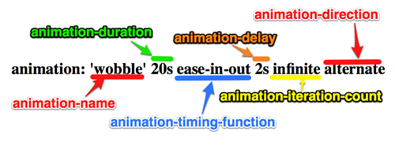

# css 动画 - animation 动画效果

## 概述

animation 动画是利用 css3 中的 animation 和 keyframes  结合使用实现的，animation 是用来定义动画名称、
动画持续时间、动画频率、动画延迟时间、是否循环播放、动画方式等。而 keyframes 俗称“关键帧”是来定义动画播放各帧效果的，类似于 flash 中的帧。

## keyframes

Keyframes 语法规则是由"@keyframes"开头，后面紧接着是这个“动画的名称”加上一对花括号“{}”，括号中就是一些不同时间段样式规则，有点像我们css的样式写法一样。对于一个"@keyframes"中的样式规则是由多个百分比构成的，如“0%”到"100%"之间，我们可以在这个规则中创建多个百分比，分别给每一个百分比中给需要有动画效果的元素加上不同的属性，从而让元素达到一种在不断变化的效果，比如说移动，改变元素颜色，位置，大小，形状等，不过有一点需要注意的是，我们可以使用“from”和“to”来代表一个动画是从哪开始，到哪结束，也就是说这个 "from"就相当于"0%"而"to"相当于"100%",值得一说的是，其中"0%"不能像别的属性取值一样把百分比符号省略，我们在这里必须加上百分符号（“%”）。如果没有加上的话，我们这个keyframes是无效的，不起任何作用。因为keyframes的单位只接受百分比值。

keyframes可以指定任何顺序排列来决定Animation动画变化的关键位置。其具体语法规则如下：

```css
 keyframes-rule: '@keyframes' IDENT '{' keyframes-blocks '}';
 keyframes-blocks: [ keyframe-selectors block ]* ;
 keyframe-selectors: [ 'from' | 'to' | PERCENTAGE ] [ ',' [ 'from' | 'to' | PERCENTAGE ] ]*;
```

分开展示其语法为

```css
   @keyframes animation-name {
     from {
       properties: properties value;
     }
     percentage {
       properties: properties value;
     }
     to {
       properties: properties value;
     }
   }
   //或者全部写成百分比的形式
   @keyframes IDENT {
      0% {
         properties: properties value;
      }
      Percentage {
         properties: properties value;
      }
      100% {
         properties: properties value;
      }
    }
```

## animation

animation 是如下属性的简写形式：animation-name, animation-duration, animation-timing-function, animation-delay, animation-iteration-count, animation-direction 和 animation-fill-mode.

各属性初始值为

* animation-name: none
* animation-duration: 0s
* animation-timing-function: ease
* animation-delay: 0s
* animation-iteration-count: 1
* animation-direction: normal
* animation-fill-mode: none
* animation-play-state: runnin

animation 适应于所有元素，包括伪类 after 和 before

下面分别介绍一下个属性的用法

### 1. animation-name:

语法

```animation-name: none | IDENT[,none | IDENT]*;```

取值说明

animation-name: 是用来定义一个动画的名称，其主要有两个值：IDENT是由Keyframes创建的动画名，换句话说此处的IDENT
要和Keyframes中的IDENT一致，如果不一致,将不能实现任何动画效果；none为默认值，当值为none时，将没有任何动画效果。
另外我们这个属性跟前面所讲的transition一样，可以同时附几个animation给一个元素，我们只需要用逗号“，”隔开。

### 2. animation-duration：

语法

```animation-duration: <time>[,<time>]*```


取值说明

animation-duration是用来指定元素播放动画所持续的时间，取值: <time>为数值，单位为s（秒.）其默认值为 “0”。
这个属性跟transition中的transition-duration使用方法是一样的。

### 3. animation-timing-function:

语法

```css
   animation-timing-function:ease | linear | ease-in | ease-out | ease-in-out |
   cubic-bezier(<number>, <number>, <number>, <number>) [, ease | linear | ease-in | ease-out |
   ease-in-out | cubic-bezier(<number>, <number>, <number>, <number>)]*
```

取值说明

animation-timing-function: 是指元素根据时间的推进来改变属性值的变换速率，说得简单点就是动画的播放方式。
他和transition中的transition-timing-function一样，具有以下六种变换方式

1、ease：（逐渐变慢）默认值，ease函数等同于贝塞尔曲线(0.25, 0.1, 0.25, 1.0).

2、linear：（匀速），linear 函数等同于贝塞尔曲线(0.0, 0.0, 1.0, 1.0).

3、ease-in：(加速)，ease-in 函数等同于贝塞尔曲线(0.42, 0, 1.0, 1.0).

4、ease-out：（减速），ease-out 函数等同于贝塞尔曲线(0, 0, 0.58, 1.0).

5、ease-in-out：（加速然后减速），ease-in-out 函数等同于贝塞尔曲线(0.42, 0, 0.58, 1.0)

6、cubic-bezier：（该值允许你去自定义一个时间曲线）， 特定的 [cubic-bezier曲线](http://en.wikipedia.org/wiki/B%C3%A9zier_curve)。 (x1, y1, x2, y2)四个值特定于曲线上点P1和点P2。所有值需在[0, 1]区域内，否则无效。


### 4. animation-delay:

语法

```animation-delay: <time>[,<time>]*```

取值说明

animation-delay: 是用来指定元素动画开始时间。取值为<time>为数值，单位为s(秒)，其默认值也是0。
这个属性和transition-delay使用方法是一样的。


### 5. animation-iteration-count

语法

```animation-iteration-count:infinite | <number> [, infinite | <number>]*```


取值说明

animation-iteration-count 是用来指定元素播放动画的循环次数，其可以取值<number>为数字，其默认值为 1
infinite为无限次数循环。

### 6. animation-direction

语法

```animation-direction: normal | reverse | alternate | alternate-reverse```

取值说明

* normal（正常）这个值是通过你列出的关键帧声明直接播放的
* reverse（反转）表示你的动画是按照你的关键帧序列反向播放的，就像回绕播放一样
* alternate（交替）如果你的动画的iteration-count属性的值大于1，你可以使用alternate值。第一次按照正常的顺序播放，第二次就会反向播放，然后正向，然后反向……方向交替，从正向开始，直到iteration-count跑完
* alternate-reverse（交替反转）alternate-reverse是和alternate一样的意思，它是从反方向开始的。


### 7. animation-fill-mode

animation-fill-mode 属性可以接受四个值

* none 默认值
* backwards 在动画结束之后，会保持最后一帧的样式
* forwards 用来处理设置动画延迟后播放，开始的时候动画的流畅性
* both forwards和backwards的结合

### 8. animation-play-state


语法

```animation-play-state:running | paused [, running | paused]*```


取值说明

animation-play-state 主要是用来控制元素动画的播放状态。其主要有两个值，running 和 paused，
其中running为默认值。
他们的作用类似于我们的音乐播放器一样，可以通过paused将正在播放的动画停下，也可以通过running将暂停的动画重新播放，
我们这里的重新播放不是从元素动画的开始播放，而是从暂停的那个位置开始播放。另外如果暂停了动画的播放，
元素的样式将回到最原始设置状态。

下面给出一图片来帮助我们理解



### animation 简写

W3C目前定义的简写顺序是这样的

```css
<single-animation> = <single-animation-name> || <single-animation-duration> ||
 <single-animation-timing-function> || <single-animation-delay> || <single-animation-iteration-count>
 || <single-animation-direction> || <single-animation-fill-mode> || <single-animation-play-state>
```

要使用简写在一个元素中定义多个动画，你需要使用逗号来分隔每个动画的属性值。比如在一个元素中定义两个动画需要这样写：

```css
animation: myAnimation 1s ease-in-out 2s 4, myOtherAnimation 4s ease-out 2s;
```

## 贝塞尔曲线

工具与资源

* [创建三次贝塞尔曲线的工具](https://matthewlein.com/ceaser/)
* [Lea Verou 创建三次贝塞尔曲线工具](http://cubic-bezier.com/)
* [三次贝塞尔曲线的交互版本-缓动函数速查表](http://easings.net/)
* [Penner easing方程](http://robertpenner.com/easing/) 有各种语言的版本，less，sass 和 js 等
* [网页动画的十二原则](http://www.w3cplus.com/css3/animation-principles-for-the-web.html)


## animation 与 keyframes 结合使用

先从例子入手，基于 webkit 内核

```css
@-webkit-keyframes wobble {
     0% {
        margin-left: 100px;
        background: green;
     }
     40% {
        margin-left: 150px;
        background: orange;
     }
     60% {
        margin-left: 75px;
        background: blue;
     }
     100% {
        margin-left: 100px;
        background: red;
     }
  }
```

这里我们定义了一个叫“wobble”的动画，他的动画是从0%开始到100%时结束，从中还经历了一个40%和60%两个过程，上面代码具体意思是
wobble动画在0%时元素 margin-left 为100px， 背景色为green，然后40%时元素过渡到  margin-left 为150px并且背景色为orange，60%时元素过渡到 margin-left 为75px，背景色为blue，最后100%结束动画的位置元素又回到起点 margin-left 为100px处,背景色变成red。

Keyframes定义好了以后，我们需要通过 animation 来调动画 “wobble”

CSS3的animation类似于transition属性，他们都是随着时间改变元素的属性值。他们主要区别是transition需要触发一个事件(hover事件或click事件等)才会随时间改变其css属性；而animation在不需要触发任何事件的情况下也可以显式的随着时间变化来改变元素css的属性值，从而达到一种动画的效果。这样我们就可以直接在一个元素中调用animation的动画属性,基于这一点，css3的animation就需要明确的动画属性值，这也就是回到我们上面所说的，我们需要keyframes来定义不同时间的css属性值,达到元素在不同时间段变化的效果。

下面为调用 wobble 代码

```css
.animation-wobble {
     width: 50px;
     height: 50px;
     margin-left: 100px;
     background: blue;
     -webkit-animation-name: wobble;/*动画属性名，也就是我们前面keyframes定义的动画名*/
     -webkit-animation-duration: 10s;/*动画持续时间*/
     -webkit-animation-timing-function: ease-in-out; /*动画频率，和transition-timing-function是一样的*/
     -webkit-animation-delay: 2s;/*动画延迟时间*/
     -webkit-animation-iteration-count: 10;/*定义循环资料，infinite为无限次*/
     -webkit-animation-direction: alternate;/*定义动画方式*/
  }
```

点击查看 [wobble 例子效果](../../examples/css3/animation/animation/wobble.html)

CSS Animation动画效果将会影响元素相对应的css值，在整个动画过程中，元素的变化属性值完全是由animation来控制，
动画后面的会覆盖前面的属性值。如上面例子，其默认值是：margin-left:100px;background: blue；
但当我们在执行动画0%时，margin-left:100px,background:green；当执行到40%时，
属性变成了：margin-left:150px;background:orange;当执行到60%时margin-left:75px;background:blue;
当动画 执行到100%时：margin-left:100px;background: red;此时一次动画完成。
margin-left和background两个属性值将是以100%时为主。接着执行下次动画效果，此时不会产生叠加效果，
只是一次一次覆盖前一次出现的css属性。就如我们平时的css一样，最后出现的权限是最大的。当动画结束后，样式回到默认效果。

## 实例讲解

### 1. 发光变色的button

这个例子主要是通过在 keyframes 中改变元素的 background;color;box-shadow 三个属性，来达到一种发光变色的button效果，
我们来看其实现代码

HTML Code

```html
<a href="" class="btn">发光的button</a>
```

CSS Code

```css
  /*给这个按钮创建一个动名名称：buttonLight，然后在每个时间段设置不同的background,color来达到变色效果，改变box-shadow来达到发光效果*/
  @-webkit-keyframes buttonLight {
     from {
       background: rgba(96, 203, 27,0.5);
       -webkit-box-shadow: 0 0 5px rgba(255, 255, 255, 0.3) inset, 0 0 3px rgba(220, 120, 200, 0.5);
       color: red;
     }
     25% {
       background: rgba(196, 203, 27,0.8);
       -webkit-box-shadow: 0 0 10px rgba(255, 155, 255, 0.5) inset, 0 0 8px rgba(120, 120, 200, 0.8);
       color: blue;
    }
    50% {
      background: rgba(196, 203, 127,1);
      -webkit-box-shadow: 0 0 5px rgba(155, 255, 255, 0.3) inset, 0 0 3px rgba(220, 120, 100, 1);
      color: orange;
    }
    75% {
      background: rgba(196, 203, 27,0.8);
      -webkit-box-shadow: 0 0 10px rgba(255, 155, 255, 0.5) inset, 0 0 8px rgba(120, 120, 200, 0.8);
      color: black;
    }
   to {
     background: rgba(96, 203, 27,0.5);
     -webkit-box-shadow: 0 0 5px rgba(255, 255, 255, 0.3) inset, 0 0 3px rgba(220, 120, 200, 0.5);
     color: green;
    }
  }
  a.btn {
    /*按钮的基本属性*/
    background: #60cb1b;
    font-size: 16px;
    padding: 10px 15px;
    color: #fff;
    text-align: center;
    text-decoration: none;
    font-weight: bold;
    text-shadow: 0 -1px 1px rgba(0,0,0,0.3);
    -moz-border-radius: 5px;
    -webkit-border-radius: 5px;
    border-radius: 5px;
    -moz-box-shadow: 0 0 5px rgba(255, 255, 255, 0.6) inset, 0 0 3px rgba(220, 120, 200, 0.8);
    -webkit-box-shadow: 0 0 5px rgba(255, 255, 255, 0.6) inset, 0 0 3px rgba(220, 120, 200, 0.8);
    box-shadow: 0 0 5px rgba(255, 255, 255, 0.6) inset, 0 0 3px rgba(220, 120, 200, 0.8);
    /*调用animation属性，从而让按钮在载入页面时就具有动画效果*/
    -webkit-animation-name: buttonLight; /*动画名称，需要跟@keyframes定义的名称一致*/
    -webkit-animation-duration: 5s;/*动画持续的时间长*/
    -webkit-animation-iteration-count: infinite;/*动画循环播放的次数*/
  }
 ```

效果

[发光变色的button](../../examples/css3/animation/animation/button-light.html)

### 2. 方形旋转变成圆形

我们这个demo是通过 transform 的 rotate 和 border-radius 值，把一个方形图片随着时间的推移，慢慢的转换成一个圆形图片，
下面我们来看看其具体实现的效果

HTML Code

```html
<a href="#" class="box" id="round"></a>
<span class="click-btn">Click</span>
```


CSS Code

```css

  /*定义方型转化为圆型的动画round*/
  @-webkit-keyframes round {
     from{
       -webkit-transform: rotate(36deg);
       -webkit-border-radius: 2px;
     }
  10%{
      -webkit-transform: rotate(72deg);
      -webkit-border-radius: 4px;
     }
  20% {
      -webkit-transform: rotate(108deg);
      -webkit-border-radius: 6px;
    }
  30% {
      -webkit-transform: rotate(144deg);
      -webkit-border-radius: 9px;
    }
  40%{
     -webkit-transform: rotate(180deg);
     -webkit-border-radius: 12px;
  }
  50%{
     -webkit-transform: rotate(216deg);
     -webkit-border-radius: 14px;
  }
  60% {
     -webkit-transform: rotate(252deg);
     -webkit-border-radius: 16px;
  }
  70% {
     -webkit-transform: rotate(288deg);
     -webkit-border-radius: 19px;
  }
  80%{
     -webkit-transform: rotate(324deg);
     -webkit-border-radius: 22px;
  }
  to {
     -webkit-transform: rotate(360deg);
     -webkit-border-radius: 25px;
  }
}
   /*给方型box一个初步样式*/
   a.box {
      display: block;
      width: 50px;
      height: 50px;
      background: red;
      margin-bottom: 20px;
   }
   /*圆型box的样式，并在这里应用animation*/
   a.round {
      -webkit-border-radius: 25px;
      -moz-border-radius: 25px;
      border-radius: 25px;
      background: green;
      -webkit-animation-name: round; /*动画名称*/
      -webkit-animation-duration: 5s;/*播放一次所持续时间*/
      -webkit-animation-timing-function: ease;/*动画播放频率*/
      -webkit-animation-iteration-count: infinite;/*动画播放次涒为无限次*/
    }

   /*click button效果*/
   .click-btn {
       background: rgba(125,220,80,0.8);
       -moz-border-radius: 5px;
      -webkit-border-radius: 5px;
       border-radius: 5px;
       -webkit-box-shadow: inset 0 0 8px rgba(255,255,255,0.8),0 0 10px rgba(10,255,120,0.3);
       -moz-box-shadow: inset 0 0 8px rgba(255,255,255,0.8),0 0 10px rgba(10,255,120,0.3);
       box-shadow: inset 0 0 8px rgba(255,255,255,0.8),0 0 10px rgba(10,255,120,0.3);
       padding: 5px 10px;
       color: #369;
       font-size: 16px;
       font-weight: bold;
       text-align: center;
       text-shadow: 0 -1px 0 rgba(0,0,0,0.5);
       cursor: pointer;
   }
```

js Code:

```javascript
document.getElementByClass('click-btn')[0].addEventListener('click', function() {
  var round = document.getElementById('round')
  round.className = round.className + ' round';
}, false);
```


载入时 box 是没有任何动画效果的，当我们点击了click button 后会给原 box 上加上一个 round 的 class样式，从而触发了一个round的动作。请看效果

[方形旋转变成圆形](../../examples/css3/animation/animation/round.html)


更多例子可以参考这里
* [webdesignersblog](http://www.webdesignersblog.net/css3/35-best-awesome-css3-animation-demos/)
* [slodive](http://slodive.com/web-development/best-css3-animation-demos-tutorials/)
* [impressivewebs](http://www.impressivewebs.com/demo-files/css3-animated-scene/)


## 动画相关事件

可以参见这篇文章
http://www.sitepoint.com/css3-animation-javascript-event-handlers/

## 参考文章

* http://www.w3cplus.com/content/css3-animation
* http://www.w3cplus.com/css3/CSS3-animation.html
* https://developer.mozilla.org/zh-CN/docs/Web/CSS/animation
